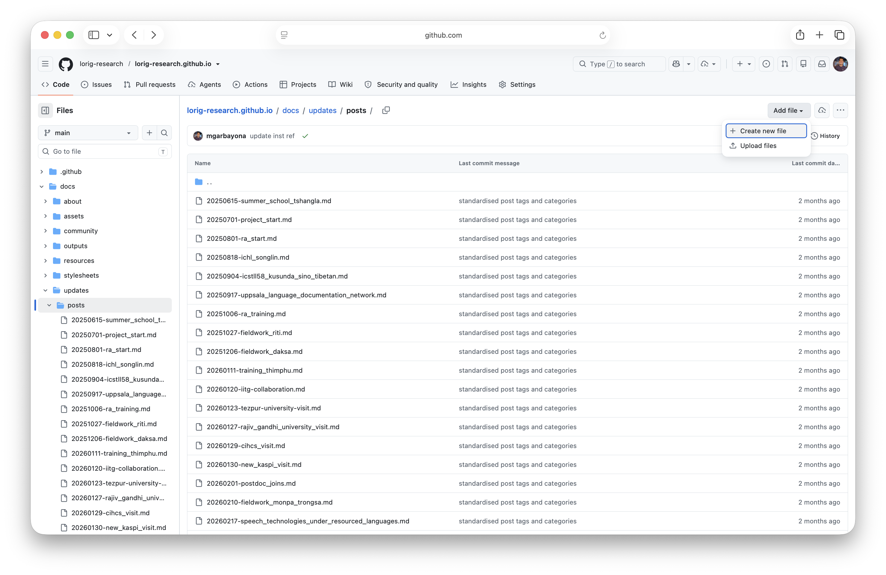
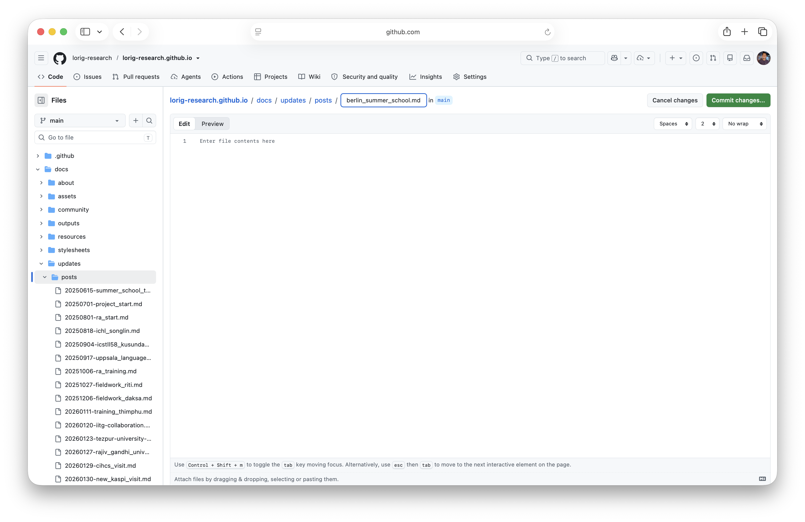
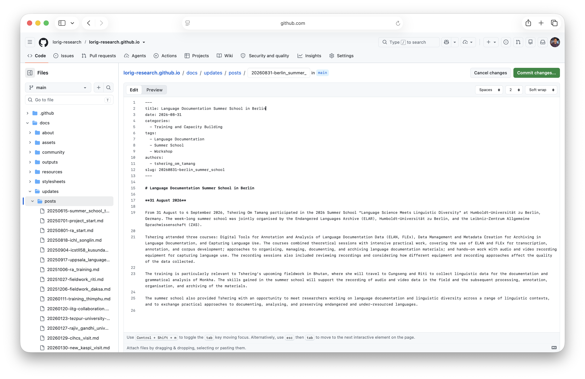
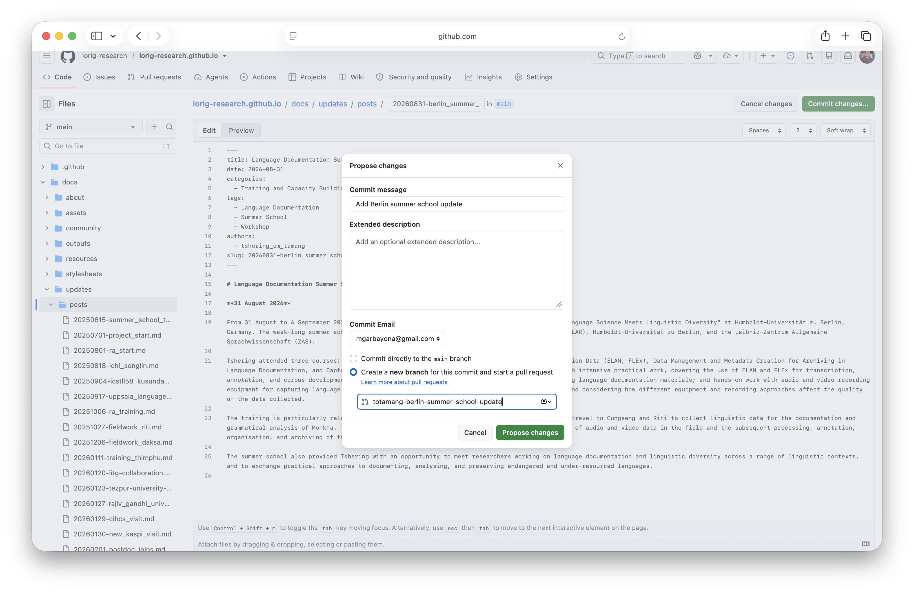
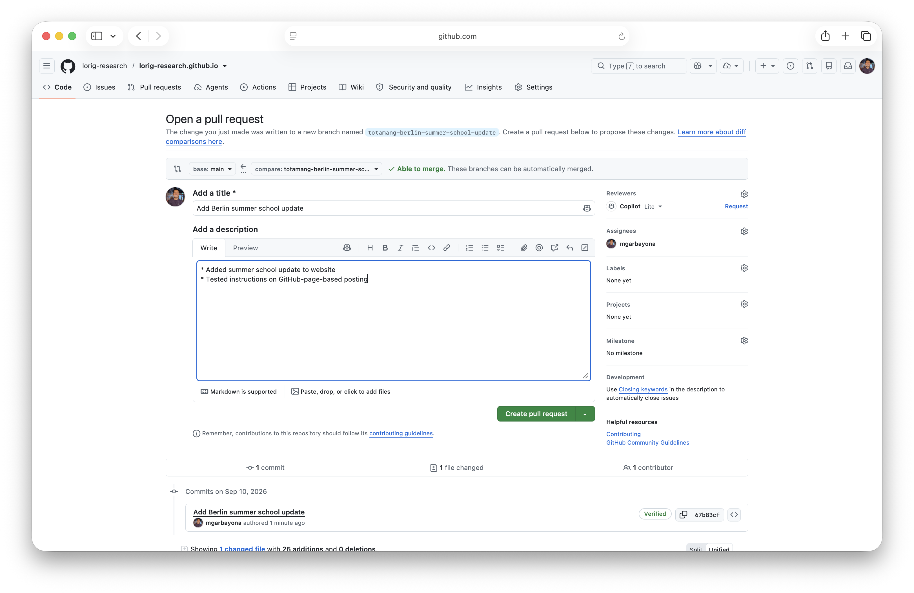

# Contributing -- Lo-Rig Website

Thanks for contributing! This guide explains how to suggest or add project updates to the Lo-Rig website.

## Which method should I use?

### Option 1: Add an update through the GitHub website
Use this if you want to add or suggest a post without using the command line.

### Option 2: Add an update from your local computer
Use this if you are comfortable using Git, editing files locally, and previewing the website.

### Option 3: Send the text and images to a project member
Use this if you are not comfortable editing the website directly.

---

## Repository Structure

* `mkdocs.yml` - site configuration
* `docs/` - all website content

  * `docs/updates/posts/` - project update posts (one `.md` file per post)
  * `docs/assets/images/updates/` - images for posts
* `stylesheets/extra.css` - additional styling
* `overrides/` - theme customisation

---

## Post Template (copy–paste template)

Use the following template:

```
---
title: Example Title
date: 2026-09-06
categories:
  - Training and Capacity Building
tags:
  - Language Documentation
  - Summer School
  - Workshop
authors:
  - your_name
slug: 20260906-example_title
image: assets/images/updates/20260505-example/image.png
---

# Example Title

**06 September 2026**

Write a short opening paragraph about the activity, event, visit, talk, or workshop.

Write one or two more paragraphs with the most important details. Keep the tone clear, factual, and neutral.
```

---

## Categories and Tags

Use **one category per post**. Categories should stay broad so that the update archive remains easy to browse. Use tags for more specific topics, places, languages, institutions, tools, and activity types.

### Standard Categories

Choose one of the following categories:

* **Project News** - project milestones, team updates, administrative updates, institutional home, project setup
* **Fieldwork and Communities** - field visits, community meetings, community-facing updates, local conditions affecting fieldwork
* **Training and Capacity Building** - training sessions, workshops, summer schools, teaching activities, capacity-building events
* **Outreach and Dissemination** - talks, seminars, conference presentations, media coverage, public-facing visibility
* **Partnerships and Networks** - institutional visits, collaborations, research networks, external academic relationship-building

Do not create new categories unless there is a clear need and the website maintainer agrees.

### Recommended Tag Usage

Tags should be specific and reusable. They can include:

* Languages and communities, for example: `Gongduk`, `Gongdue Kha`, `Monpa`, `Monkha`
* Places, for example: `Bhutan`, `Riti`, `Chungseng`, `Phuzur`, `Jangbi`, `Wangling`, `Trongsa`, `Thimphu`
* Institutions, for example: `Trinity College Dublin`, `Trinity Long Room Hub`, `Centre for Bhutan and GNH Studies`, `IIT Guwahati`, `Tezpur University`, `Rajiv Gandhi University`
* Activity types, for example: `Field Visit`, `Community Engagement`, `Workshop`, `Summer School`, `Class`, `Talk`, `Research Seminar`, `Conference`, `Conference Presentation`, `Media`, `Collaboration`, `Institutional Collaboration`
* Research themes and tools, for example: `Language Documentation`, `Linguistic Fieldwork`, `Historical Linguistics`, `Trans-Himalayan Languages`, `Speech Technology`, `ASR`, `Forced Alignment`, `ELAN`, `FLEx`, `Human Language Technology`, `Human-Centred Technology`
* Project roles or administration, for example: `Team`, `Research Assistants`, `PhD Student`, `Postdoctoral Researcher`, `Administration`, `ERC`

Keep tags consistent with existing posts. For example, use `Field Visit` rather than alternating between `Field Visit` and `Fieldwork` when referring to a specific project visit.

---

## Choosing the Right Category

Use this quick guide when classifying a post:

| If the post is mainly about... | Use this category | Put these details in tags |
| --- | --- | --- |
| A project start, team member, institutional home, or internal milestone | `Project News` | `Team`, `PhD Student`, `Postdoctoral Researcher`, `ERC`, `Trinity College Dublin` |
| A village visit, field recording trip, community meeting, or fieldwork access issue | `Fieldwork and Communities` | `Field Visit`, `Community Engagement`, village names, language names, `Media`, `Infrastructure` |
| A workshop, training session, summer school, or teaching activity | `Training and Capacity Building` | `Workshop`, `Summer School`, `Class`, `Research Assistants`, `ASR`, `Linguistic Fieldwork` |
| A talk, research seminar, conference presentation, or media mention | `Outreach and Dissemination` | `Talk`, `Research Seminar`, `Conference`, `Conference Presentation`, `Media`, topic tags |
| A university visit, external collaboration, or research network meeting | `Partnerships and Networks` | `Collaboration`, `Institutional Collaboration`, institution names, country or region tags |

---

## Option 1: Adding a project update through the GitHub website

### 1. Prepare the text and images

Before opening GitHub, prepare the following:

- title of the update
- date of the activity or event
- short text for the update, usually 1--3 paragraphs
- author name(s)
- 1--3 possible photos, if available

It is fine to draft the text in Word or Google Docs first.

### 2. Create the post file

1. Go to the repository on GitHub:

👉 https://github.com/lorig-research/lorig-research.github.io

2. Open this folder:

```
docs/updates/posts/
```

3. Click **Add file** &rarr; **Create new file**.



4. Name the file using this format:

```
YYYYMMDD-short_title.md
```

Example:

```
20260906-berlin_summer_school.md
```



5. Copy and paste the post template into the text box.

### 3. Use the template (see Post Template section) 

The `slug` should match the filename without `.md`.

For example:

```
filename: 20260906-berlin_summer_school.md
slug: 20260906-berlin_summer_school
```



### 4. Choose one category and relevant tags

Please use one category only. See Standard Categories section for options.

Use tags for more specific details, such as languages, places, people, institutions, tools, talks, workshops, or media items. See Recommended Tag Usage section for examples.

### 5. Add images, if comfortable

If you are comfortable uploading photos, place them in:

```
docs/assets/images/updates/YYYYMMDD-post_name/
```

Example:

```
docs/assets/images/updates/20260906-berlin_summer_school/
```

Use clear filenames, such as:

```
20260906-berlin_summer_school_group_photo.jpeg
```

or

```
20260906-berlin_summer_school_session.jpeg
```

Then add the image to the post like this:

```
<figure markdown>
{ width="85%" }
<figcaption>
Caption text.
</figcaption>
</figure>
```

If the image step is confusing, do not worry. You can create the text-only post and attach or share the photos separately. Another project member can add the images later.

### 6. Save the change

At the bottom of the GitHub page:

1. Write a short commit message, for example:

```
Add Berlin summer school update
```

2. Choose Create a new branch for this commit and start a pull request.
3. Click Propose changes.



4. On the next page, click Create pull request.



A project member can then review the update, fix formatting if needed, and merge it into the website.

## Option 2: Adding a project update from your local computer

### 1. Create a branch
### 2. Add the Markdown post
### 3. Add images
### 4. Preview locally
### 5. Commit and push
### 6. Open a pull request

---

## Images

* Store images in:

  ```
  docs/assets/images/updates/YYYYMMDD-post_name/
  ```

* Reference them like this:

  ```
  
  ```

* Use clear, descriptive filenames.

---

## Terminology

Please use the following consistently:

* **Monpa** - people / community
* **Monkha** - language

---

## Golden Rules

* Keep posts concise (usually 1–3 paragraphs is enough)
* Use clear, neutral language (avoid informal tone)
* Use one standard category per post
* Use tags for specific languages, places, institutions, tools, and activity types
* Check spelling of names and places carefully
* Keep formatting consistent with existing posts

---

## Before Submitting

* Ensure `title`, `date`, and `slug` are included
* Confirm the slug matches the filename
* Use one of the standard categories listed above
* Check that tags are spelled consistently with existing posts
* Check that images load correctly
* Preview locally if possible

## Questions

If you're unsure about anything, feel free to ask a core project member or open an issue.
