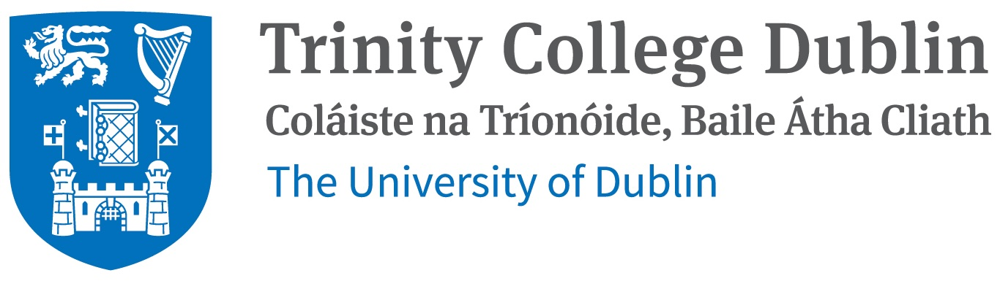

# Partners and Funders

The Lo-Rig project is hosted by Trinity College Dublin (TCD), funded by the European Research Council (ERC), and has a counterpart organisation in Bhutan, the Centre for Bhutan and GNH Studies (CBS).

## Host Institution

{ align=left, width="250" }

### Trinity College Dublin  
**School of Linguistic, Speech and Communication Sciences**

The School of Linguistic, Speech and Communication Sciences at Trinity College Dublin is home to a team of scholars who share a commitment to the study of human language in its many facets. The School fosters inclusive diversity as a powerful resource through research and teaching in linguistics, communication, speech, and swallowing. Its work benefits individuals and communities across the lifespan.

The School’s vision is to be an internationally recognised reference point for the scientific study of language, communication, speech, and swallowing, characterised by a distinctive focus on communication diversity and inclusion.

Research and teaching within the School include the following areas: Linguistics; Applied Linguistics; Computational Linguistics; Speech Science and Phonetics; Speech and Language Pathology; Dysphagia; Deaf Studies; Irish Sign Language; English Language Teaching; Irish Language Technology; and Asian Studies.

## Funding

{ align=left, width="250" }

### European Union / European Research Council

This project is funded by the European Union under the Horizon Europe research and innovation programme through a European Research Council starting grant.

## Partner Institution

{ align=left, width="150" }

### The Centre for Bhutan and GNH Studies (CBS)

The Centre for Bhutan and GNH Studies (CBS) is an autonomous government research institute for social science and public policy in Bhutan. It conducts interdisciplinary studies on Bhutan’s economy, polity, history, religion, society, culture, and related themes.

Since the mid-2000s, one of the Centre’s major areas of focus has been deepening the understanding of the Gross National Happiness concept in order to inform public policy and development discourse. Towards this end, the Centre has developed the GNH Index, GNH Policy Screening Tools, and GNH of Business Assessment Tools to support the integration of GNH into national planning processes and business practices.

The Centre also promotes scholarship on Bhutan through publications and dissemination activities, including the organisation of national and international conferences, seminars, and eminent lecture series.

Website: https://bhutanstudies.org.bt/
