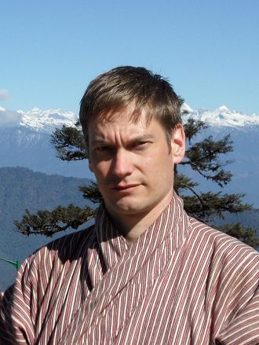
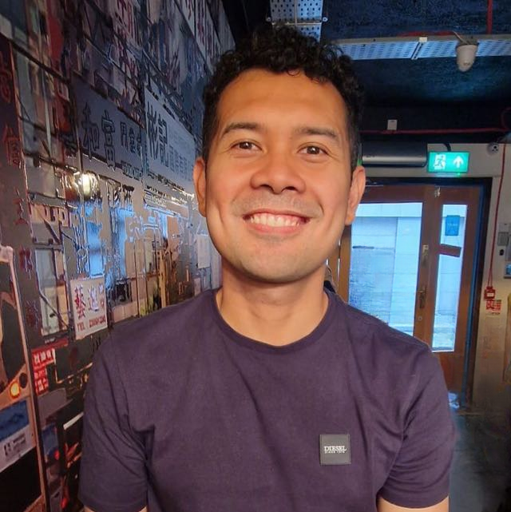
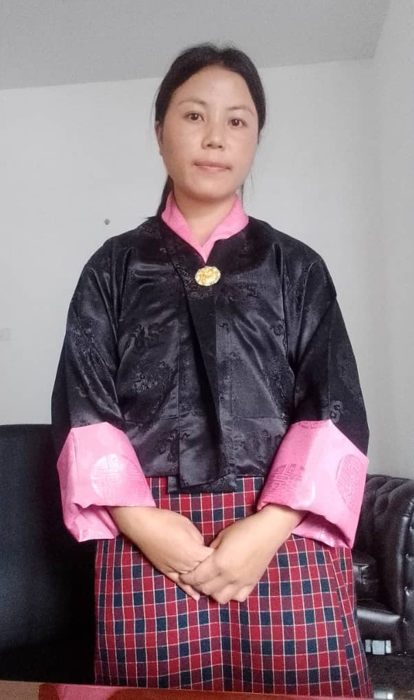
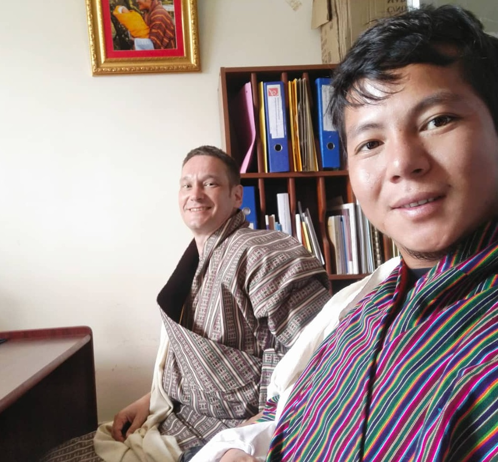

# Project Team

The Lo-Rig project is carried out by an international team of researchers based at Trinity College Dublin and in Bhutan.

## Principal Investigator

{ align=left, width="150" }
### Tim Bodt
*Principal Investigator*  
Trinity College Dublin

[Profile page](https://www.tcd.ie/Asian/people/bodtt/)

---

## Research Team

{ align=left, width="150" }
### Michael Bayona
*Researcher*  
Trinity College Dublin

{ align=left, width="150" }
### Sonam Lhamo
*Researcher*  
Bhutan

{ align=left, width="150" }
### Rinchen Wangdi
*Researcher*  
Bhutan
