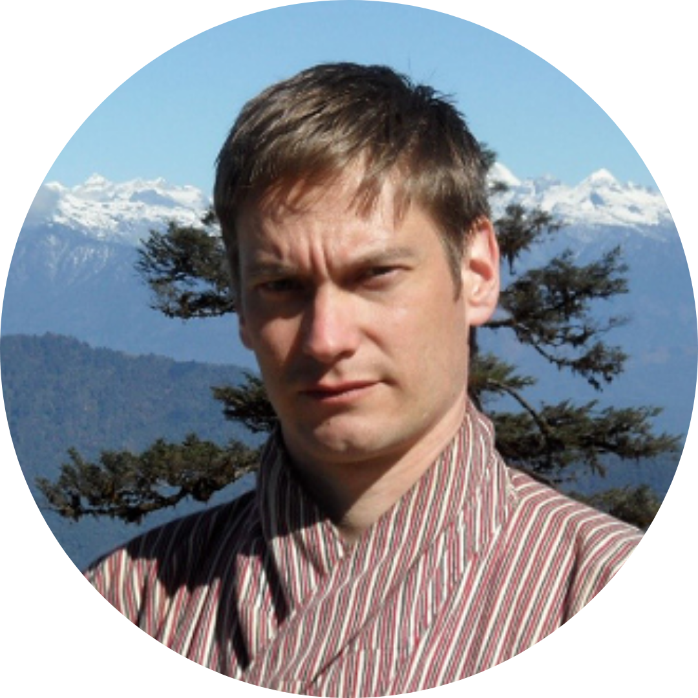
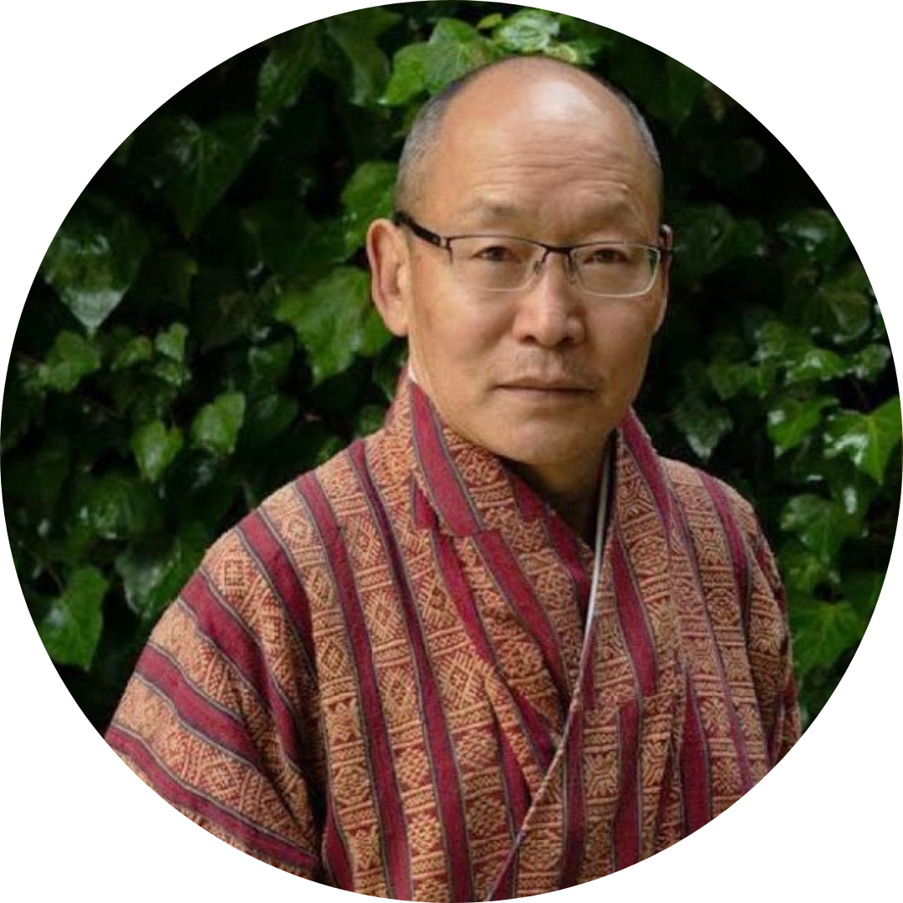
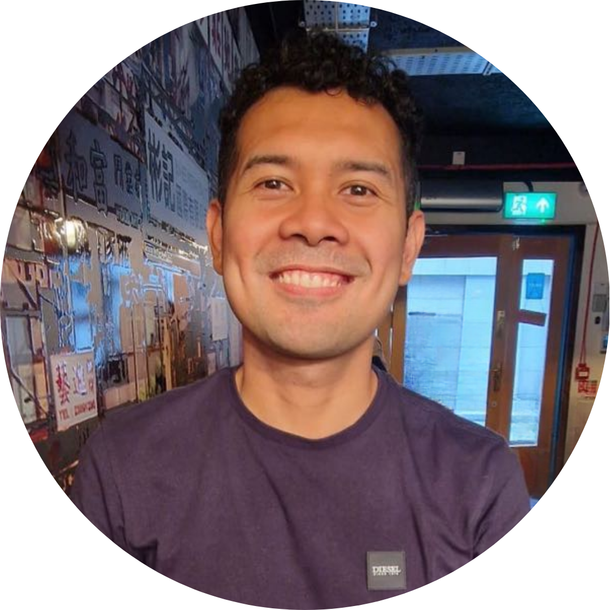
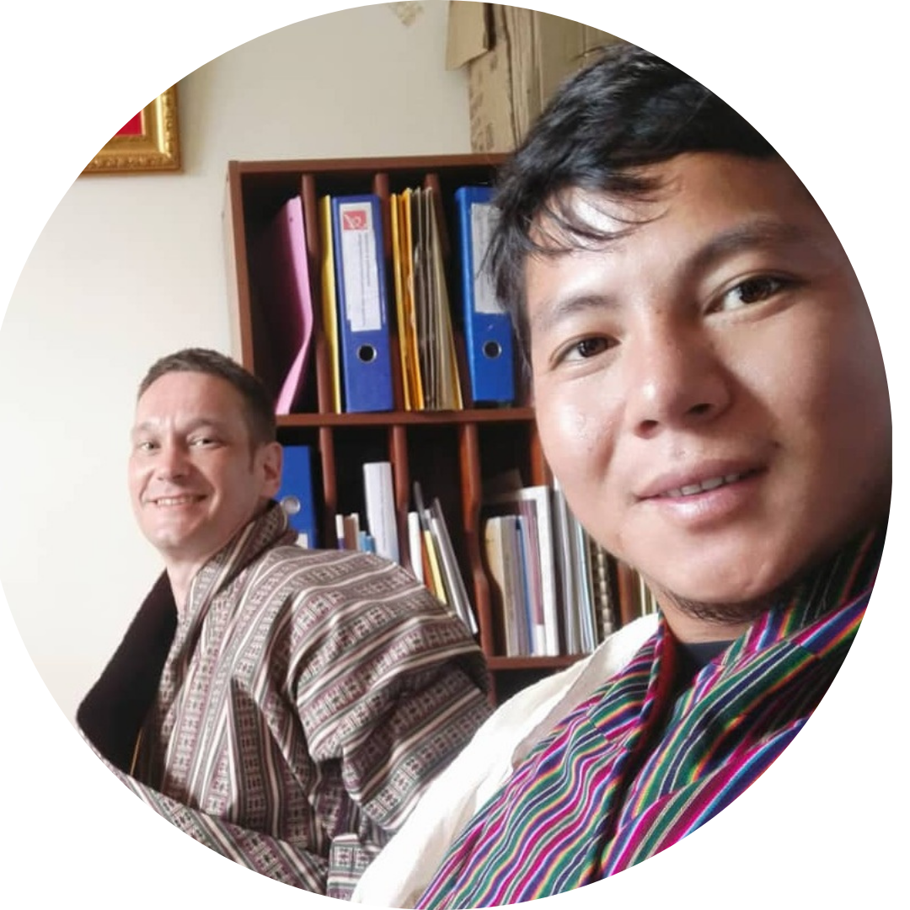
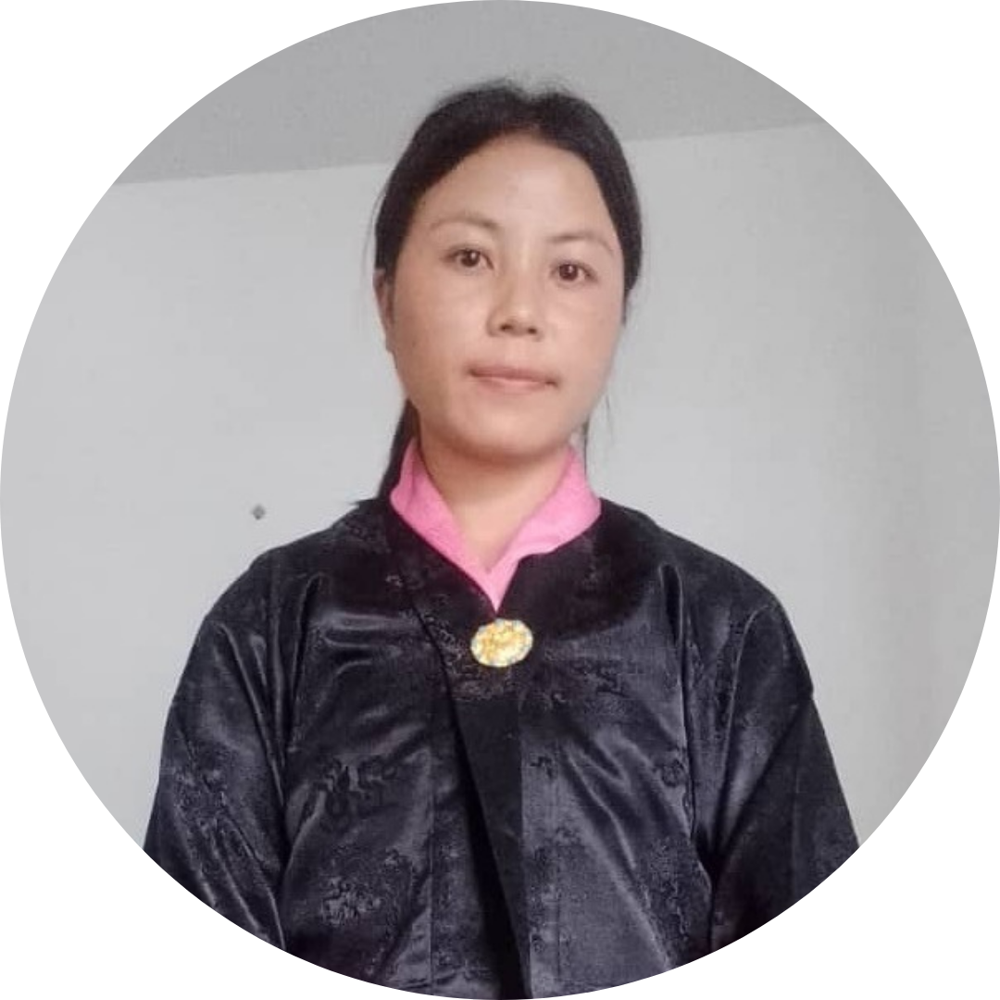
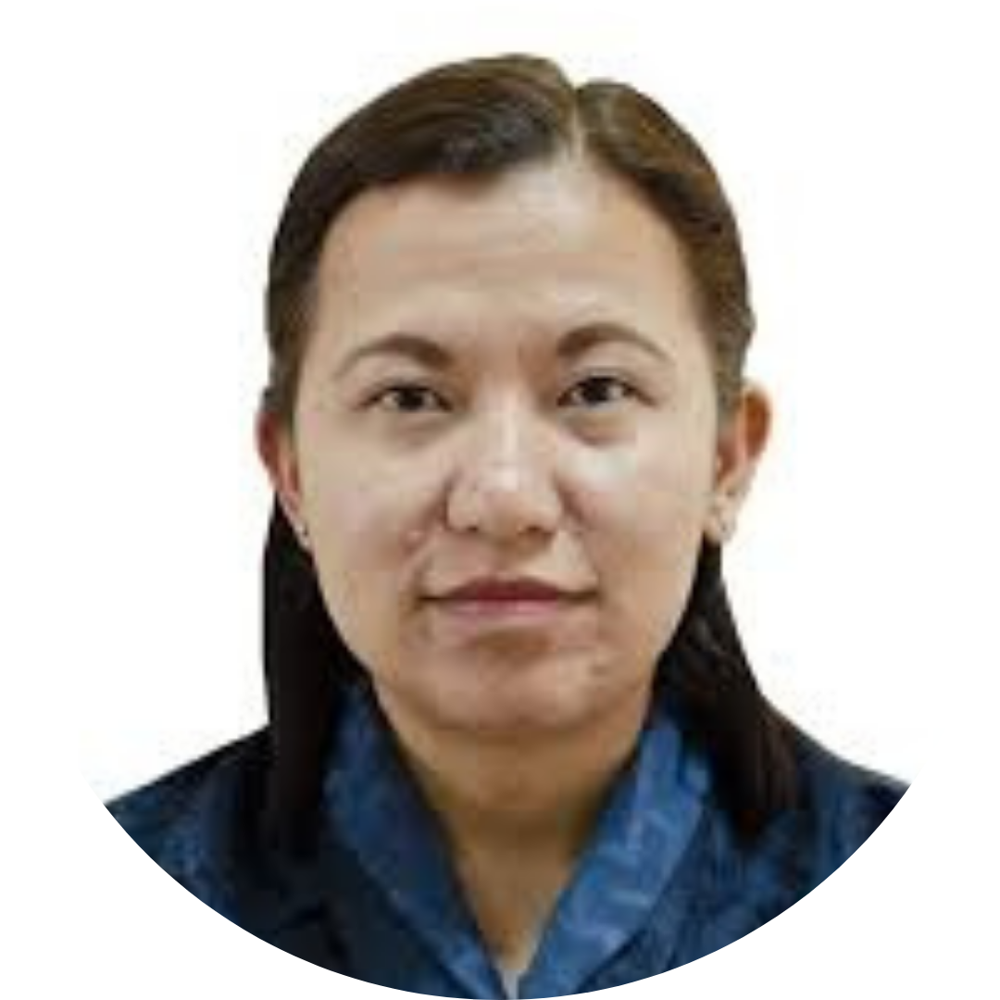

# Project Team

The Lo-Rig project is carried out by an international team of researchers based at Trinity College Dublin and in Bhutan.

## Principal Investigator

{ style="float: right; margin-left: 1rem;" width="150" }
### Timotheus Bodt
*Principal Investigator*  
Trinity College Dublin

As Principal Investigator, I have almost three decades of close association with Bhutan and the Bhutanese people. I intermittently stayed in the country for around seven years and am proficient in several of Bhutan's languages. Realising its value and potential, the Royal Government of Bhutan has officially sanctioned the Lo-Rig project.

[Profile page](https://www.tcd.ie/Asian/people/bodtt/)

---

## Research Team

{ style="float: right; margin-left: 1rem;" width="150" }

### Dasho Dr. Karma Ura
*Senior Researcher*  
Centre for Bhutan and GNH Studies

Dasho Karma is President of the Centre for Bhutan and GNH Studies in Thimphu, Bhutan. He is a graduate of Magdalen College, Oxford and a postgraduate of Edinburgh University. In 2006, he was awarded the ancient honorary title of "Dasho" by His Majesty, the 4th King of Bhutan. His essays and articles have appeared in international journals, magazines, and books. He is also a painter who has designed temple murals and thangkhas on a large scale.    

---

{ style="float: right; margin-left: 1rem;" width="150" }

### Michael Bayona
*Researcher*  
Trinity College Dublin

I am a researcher on the Lo-Rig project based at Trinity College Dublin. My work focuses on linguistic data analysis, speech and language technologies, and the development of research infrastructure to support language documentation and analysis.

My background is in speech and language processing, with experience spanning low-resource and multilingual settings. I have worked on projects involving speech recognition, perceptual evaluation, automated language assessment, and the organisation and analysis of large-scale linguistic datasets.

Within the Lo-Rig project, I contribute to the organisation, processing, and presentation of linguistic data, as well as to the development of tools and workflows that support research, analysis, and dissemination.

---

{ style="float: right; margin-left: 1rem;" width="150" }

### Rinchen Wangdi
*Researcher*  
Bhutan

My name is Rinchen Wangdi, and I am from Yangbari village, Gongdue block, Monggar district. I was born in 1998, and I am married with one daughter. I grew up speaking the Gongduk language as my father is from Bakla and a native Gongduk speaker. I also speak Khengkha, Tshangla, and Dzongkha. I successfully completed my High School Class XII in 2019.

As a native speaker of Gongduk, I am motivated to work hard and give my best for this project. I am inspired to grow, learn and contribute to the documentation, description and revitalisation of my mother tongue.

---

{ style="float: right; margin-left: 1rem;" width="150" }

### Sonam Lhamo
*Researcher*  
Bhutan

I am Sonam Lhamo, and I am 28 years old. I was born and grew up in Phuzur village under Langthil block in Trongsa district. My late parents were from Phuzur too, and I grew up speaking the Monkha language. In addition, I know Khengkha, Dzongkha, and a little Lhotshamkha and Tshangla. I completed my primary education from Jangbi school, my lower secondary school from Langthil Lower Secondary School, my middle education from Bayling Central School in Trashiyangtse district, and my higher education from Sherubling Central School in Trongsa. I am married with two daughters, and we live in Jigmechoeling block in Sarpang district, close to the Monpa communities of Chungshing and Riti.

My primary motivation to join the Lo-Rig project as a Research Assistant is to gain hands-on experience in research. Secondly, I want to work closely with the Monpa communities, especially with the elders, to bring some positive changes to the community. And finally, the interest from outsiders in the traditions, language and culture of my community motivated me to join this project.

---

{ style="float: right; margin-left: 1rem;" width="150" }

### Tshering Om Tamang
*PhD Student*  
Trinity College Dublin

Tshering Om Tamang joined the Department of Language Education in 2021 and is currently a PhD student at Trinity College Dublin. She holds a Master's degree in Teaching English as a Second Language (TESL) from The English and Foreign Languages University, Hyderabad, and an undergraduate degree in English Literature (Honours) from the University of Wollongong, NSW, Australia.

Her master's research focused on the assessment of bilingualism among learners of English as a Second Language, while her honours dissertation examined the Bhutanese English curriculum, with particular attention to the role of Bhutanese literature written in English.

